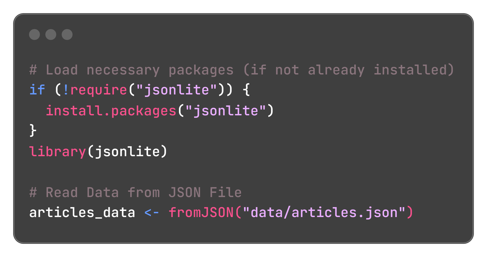
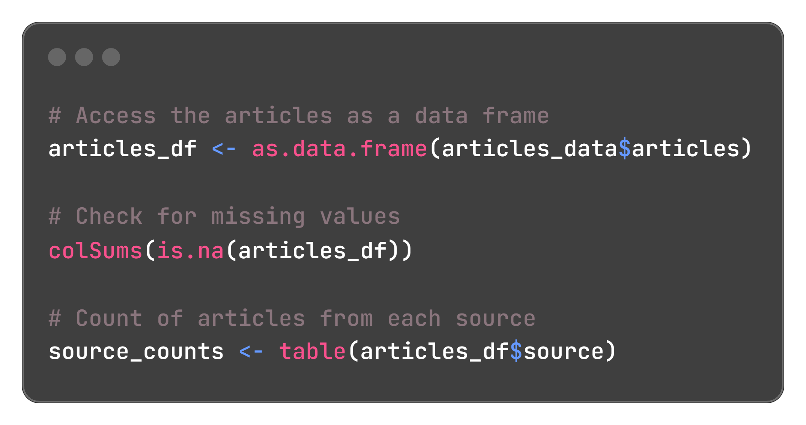
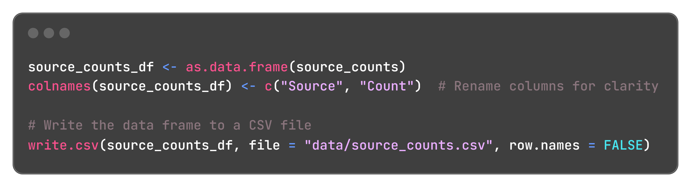
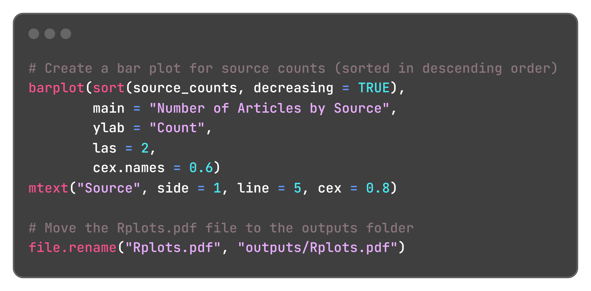
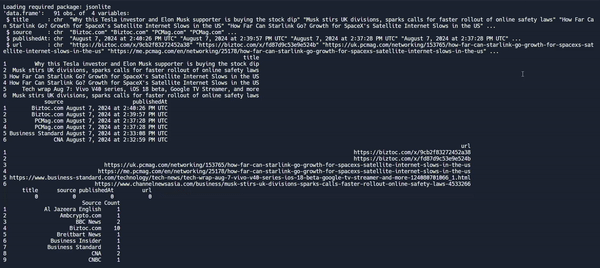

# News Article Data Analysis and Interpretation
The goal of this project is to analyze and interpret news article data using R. The project is divided into two components: data analysis and data interpretation.

## Table of Contents

- [Project Structure](#project-structure)
- [Technology Used](#technology-used)
- [Data Analysis](#data-analysis)
  - [Reading JSON Data](#reading-json-data)
  - [Cleaning and Transforming Data](#cleaning-and-transforming-data)
  - [Analyzing Source Counts](#source-counts)
  - [Visualizing Source Distribution](#visualizing-sources)
- [Interpreting News Source Counts](#interpreting-news-source-counts)
- [How to Run the Analysis](#how-to-run)
- [Example Output](#example-output)
- [Author](#author)
- [Contact](#contact)

## Project Structure

```
project-root
├── data
│   ├── articles.json
│   └── source_counts.csv
├── video
│   └── console.log.gif
├── images
│   └── analyzing.source.png
│   └── clean_transform.data.png
│   └── reading_data.png
│   └── visual_source.png
├── outputs
│   └── Rplots.pdf
├── main.r
└── README.md
```
* `data/articles.json`: JSON file containing the raw news articles data.
* `data/source_counts.csv`: CSV file with the count of articles from each source.
* `video/console.log.gif`: GIF showing the console log of the R script execution.
* `outputs/Rplots.pdf`: PDF file containing the bar plot visualizing the number of articles by source.
* `main.r`: R script for data analysis and visualization.

## Technology Used

* **R:** For data analysis and visualization.
* **Replit:** The development environment where the program was written and executed.

## Data Analysis
### Reading JSON Data
The analysis begins by reading the news articles data from a JSON file using the `jsonlite` package in R.


### Cleaning and Transforming Data
The articles are converted into a data frame, and initial exploratory data analysis is performed to check for missing values and understand the structure of the data.


### Analyzing Source Counts
The source counts are calculated, and the data is saved to a CSV file for further analysis and interpretation.



### Visualizing Source Distribution
A bar plot is generated to visualize the number of articles from each source. The plot is saved as a PDF in the `outputs` directory.



## Interpreting News Source Counts
The analysis provides insights into the distribution of news articles across different sources. By examining the `source_counts.csv` and the `Rplots.pdf`, you can interpret which sources contribute most heavily to the dataset and explore potential biases or trends.

## How to Run the Analysis
1. Clone the repository: `git clone https://github.com/yourusername/project-name.git`
`cd project-name`
2. Run the R script:
`Rscript main.r`
3. Review the output files:
   - `data/source_counts.csv` for the article counts per source.
   - `outputs/Rplots.pdf` bar plot visualizing the source counts.

## Example Output
Example console output<br>


## Author
**Carisa Saenz-Videtto**

## Contact
carisasaenz@gmail.com
